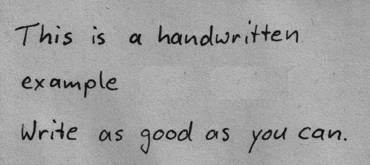
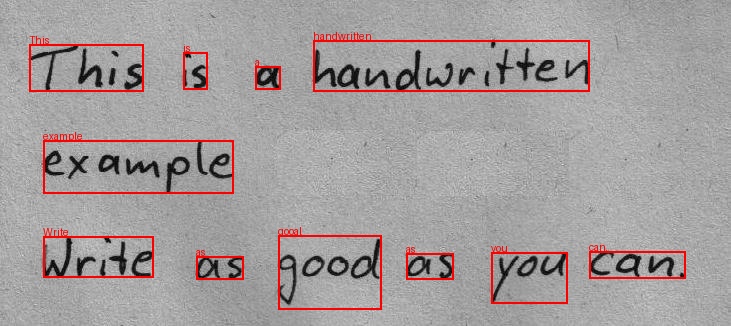

# 📝 Image to Text (OCR)  

This repository contains scripts that use **Tesseract OCR** to extract text from images.  

## 📌 Features  

- **i2t_img.py** → Extracts text from static images  
- **i2t_webcam.py** → Captures frames from a webcam and extracts text in real time  
- Uses **Tesseract OCR** for high-accuracy text recognition  
- Supports multiple languages (default: English)  

---

## 🛠️ Installation  

Ensure you have **Python 3.8+** and **Tesseract-OCR** installed.  

### 1️⃣ Install Dependencies  

```bash
pip install pytesseract opencv-python pillow
```
### 2️⃣ Install Tesseract-OCR
- Windows: Download and install [Tesseract OCR](https://github.com/UB-Mannheim/tesseract/wiki).
- Linux (Ubuntu/Debian):
    ```bash
    sudo apt install tesseract-ocr
    ```
- Mac (Homebrew):
    ```bash
    brew install tesseract
    ```
- for more details: [click here](https://tesseract-ocr.github.io/tessdoc/Installation.html)

## 🚀 Usage
##### 📷 Extract Text from an Image
Run the `i2t_img.py` script and provide an image file in the script
```bash
python i2t_img.py
```
##### 🎥 Extract Text from Webcam
Run the i2t_webcam.py script to capture frames and extract text in real time:
```bash
python i2t_webcam.py
```

## 📜 Output
- The extracted text from images is printed to the terminal.
- For i2t_webcam.py, text is continuously extracted and displayed in real time.

##### Sample Input: 

##### Sample Output: 


---
###### Made with ❤️ by [Sanfinity](https://github.com/Sanfinity/)
